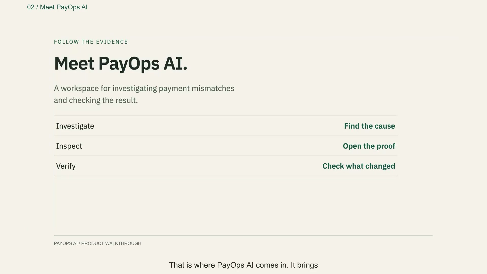
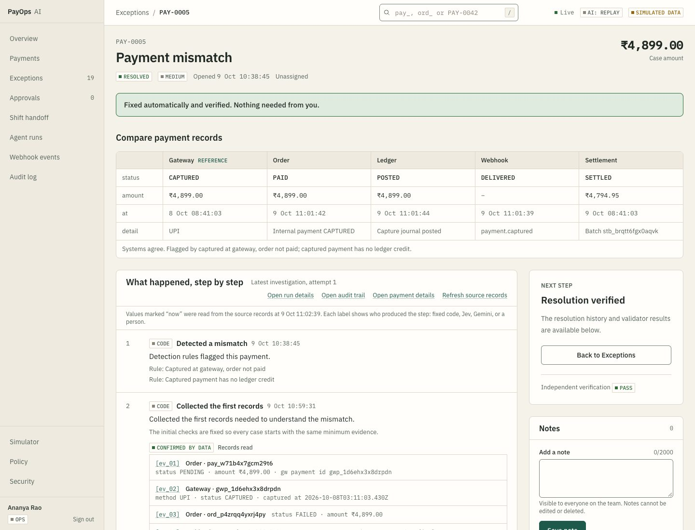
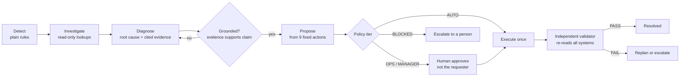
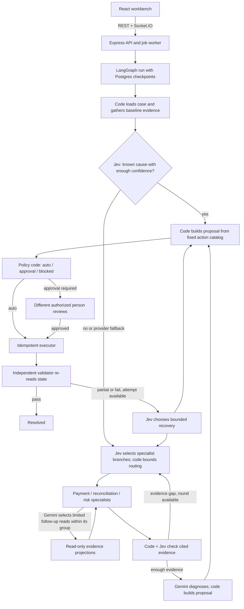

# PayOps AI

Payment reconciliation with a checked AI investigator. When a payment looks wrong in one of a company's systems, PayOps AI works out why, cites the evidence, proposes a fix, applies it only within strict rules, and verifies that the fix worked. A person approves anything risky. The product works with the AI turned off.

[](docs/demo/payops-demo.mp4?raw=true)

**Watch the product walkthrough:** a payment problem, the PayOps AI reveal, a complete example, evidence, approval, and verification. Includes female English narration and subtitles.

- **Video:** click the poster above to open the current MP4. See [publishing instructions](docs/demo/README.md#share-on-github) for inline playback or a hosted video link.
- **After cloning or unzipping:** open `docs/demo/payops-demo.mp4` in any video player (QuickTime, VLC, a browser). It is a standard H.264/AAC MP4, with English narration and subtitles.
- **Text version:** [transcript](docs/demo/transcript.md), [subtitles (SRT)](docs/demo/payops-demo.srt), and [how the video was made](docs/demo/README.md).

**New to the project?** Start with the [guide](docs/guide/README.md): product, architecture, the agents and how they are orchestrated, safety, replay, a file map, and interview prep, in plain English.



## What this is, in plain words

When you pay for something online, the money and the paperwork travel through several separate computer systems owned by different teams or companies. Most of the time they all agree. Sometimes one message gets lost, and then they disagree: the bank has your money, but the shop still says "payment failed" and the accounts show nothing. Someone in a company's finance or operations team then spends up to an hour finding which system is wrong, and how to correct it without making it worse.

PayOps AI does that job. It watches for disagreements, investigates each one like a careful analyst, and proposes a specific fix. Small safe fixes happen automatically. Anything that moves money needs a person to approve it. Every step is written to an audit trail.

You do not need to know payments to follow the rest. The five systems are:

| System | What it is | Everyday analogy |
|---|---|---|
| Gateway | The payment processor that actually takes the card payment | The card machine at the till |
| Order service | The shop's own record of whether the order is paid | The shop's order book |
| Ledger | The company's accounting entries | The accountant's books |
| Webhook | An automatic message from the gateway telling the shop "this payment succeeded" | A text message saying "money received" |
| Settlement | The later batch transfer that pays the money out to the merchant | The end-of-day bank deposit |

A healthy payment shows the same story in all five. A **case** is opened when they do not. Eight kinds of fault are simulated (plus a healthy control), from a payment whose "money received" message failed to a payout batch that is short.

## A worked example: the missing message

**What happened.** A customer paid ₹12,499. The gateway captured the money. The gateway then sent the shop the "money received" message, but the shop's server returned an error three times, so the shop never marked the order as paid and the accounts never recorded the money. The customer has paid, and the shop thinks they have not.

**What the case looks like when it opens** (the "state matrix" on every case page):

| | Gateway | Order | Ledger | Webhook | Settlement |
|---|---|---|---|---|---|
| status | CAPTURED | FAILED | missing | FAILED (HTTP 500 x3) | not yet |
| amount | ₹12,499.00 | ₹12,499.00 | none | none | none |

**What PayOps AI does**, in order:

1. **Detects it.** A plain rule spots that the gateway says "captured" while the order says "not paid". No AI is involved in finding problems.
2. **Investigates.** Code gathers a fixed baseline from the available systems, then selected specialists may request extra records. Each fact gets an evidence id such as `ev_04`.
3. **Explains the cause, with citations.** "The webhook to the order service failed three times with HTTP 500, so the order was never marked paid, even though the gateway captured the money." Every claim points to the evidence that supports it, and a separate check rejects any claim whose evidence does not actually say that.
4. **Proposes a fix from a fixed menu.** Here: replay the failed message. The AI cannot invent an action, only choose from nine.
5. **Applies the policy.** Replaying a message only corrects our own records and moves no money, so the policy allows it automatically.
6. **Verifies.** A separate checker re-reads all five systems. The screenshot above is the result: every system now agrees and the case is resolved.

This whole path is the case screen at the top of this page: the state matrix, the numbered investigation steps, the root cause with clickable evidence, and the proposed fix.

## A second example: when a human must decide

**What happened.** A customer's order was cancelled after they had paid ₹78,000, but no refund was ever started anywhere. The money is still with the shop and the customer is waiting.

PayOps AI finds this the same way and proposes **initiate a refund of ₹78,000**. This time the policy stops it. Sending money back is a money movement, so it is classified as needing a **manager**. The case waits in **Approvals**. A manager reviews the evidence and the exact amount, and can approve or reject. The person who requested it cannot approve it (four-eyes rule). Only after approval does the system execute the refund once (guarded so it can never run twice), and then the validator re-checks that the refund exists and the amounts add up.

The point of this example is the boundary: the AI does the slow investigation, and people keep the authority over money.

## How decisions are made

Models propose and code decides. A model never touches the database, never does arithmetic or date math, and never approves or executes anything. Amounts are integer paise computed by code and passed in as facts.



| Stage | Who decides | What it does |
|---|---|---|
| Detect | Rules (code) | Flag mismatches across gateway, order, ledger, webhook and settlement |
| Screen notes | Jev, coded fallback | Screen customer-supplied text before it reaches a model |
| Route | Jev, coded fallback | Choose which specialist nodes to run |
| Diagnose | Gemini, schema-checked; Jev fast path for known faults | Reason over gathered evidence into findings that cite evidence ids |
| Check grounding | Jev plus code | Reject findings that cite evidence that does not support them |
| Propose | Code | Pick actions from a fixed catalog of nine, with computed parameters |
| Assign tier | Policy engine (code) | AUTO, OPS approval, MANAGER approval, or BLOCKED |
| Approve | People | Four-eyes: the approver cannot be the requester |
| Execute | Executor (code) | Run each action once, guarded by an idempotency key |
| Verify | Validator (code) | Re-read the data; return PASS, PARTIAL or FAIL |
| On FAIL | Jev, coded fallback | Replan within limits, otherwise escalate to a person |

Every model-facing decision sits behind a port with a coded fallback, so a slow or unsure model degrades to a safe path instead of blocking work.

### The agents, who they are

- **Jev** is a small, fast decision model (by TypeSafe) used for quick classifications: is this note safe, which specialists are needed, is this claim supported, is the diagnosis confident enough. When it is confident about a known fault, the case takes a **fast path** with no Gemini call at all.
- **Gemini** is the larger reasoning model used for the full investigation when the case is not a clear-cut known fault. Its output must match a strict schema, and every finding must cite evidence.
- **Three specialists** each look at their slice of the evidence in parallel: a **payment** specialist (gateway, order, webhook), a **reconciliation** specialist (ledger, refunds, settlement) and a **risk** specialist (customer and device history, for suspicious payments). A join step combines their findings.
- **Code** does everything that must be exact and repeatable: detection, all arithmetic, policy tiers, execution, and verification.

### Guardrails a non-engineer can rely on

- **The AI cannot invent an action.** It can only choose from nine typed actions, each with a defined check that proves it worked.
- **Evidence or it does not count.** A claim without supporting evidence is dropped.
- **Customer text is treated as data, not instructions.** One test scenario has a customer note that tries to order a full refund; the system screens it and does not obey it.
- **Independent verification.** The validator is separate from the thing that made the change, so a wrong fix is caught rather than assumed correct.
- **A full audit trail** records every step and who approved what.

## Architecture

Hexagonal monorepo in TypeScript. The domain core depends on ports; adapters implement them. The agent system is a client of the core.

```
apps/web (React 19, Vite, Tailwind v4)  <-- REST + Socket.IO -->  apps/server (Express 5)
                                                                     |
                     packages/agents (LangGraph)  ->  packages/core (domain, policy, executor, validator, ports)
                                                                     |
        adapters: Postgres/PGlite, Simulator gateway, Gemini LLM, Jev decisions, cassette record/replay
```

| Package | Role |
|---|---|
| `apps/web` | Operator UI: overview, cases, approvals, agent runs, simulator, public landing |
| `apps/server` | REST API, realtime events, auth, job queue |
| `packages/core` | Domain services, policy engine, executor, validator, ports and adapters |
| `packages/agents` | LangGraph investigation graph and nodes |
| `packages/simulator` | Seeded fault generator for the 21 scenarios |
| `packages/evals` | Golden-scenario eval harness |
| `packages/shared` | DTOs and types shared by web and server |

One database holds business data, the job queue and LangGraph checkpoints. There is no Redis and no separate worker process.

The investigation has a fixed safety spine and bounded choices. This is the implemented route, not a free-form tool loop:



Jev and Gemini calls retry temporary rate limits, timeouts and service outages up to three total attempts before their existing safe fallback. Invalid requests and REPLAY cassette misses are not retried. Retries in an investigation are recorded in its step trail; REPLAY itself makes no provider calls.

### Record and replay

AI calls go through cassettes. `AI_MODE=RECORD` saves live model responses to `fixtures/cassettes/`, `REPLAY` serves them by content hash with no network calls, and `LIVE` calls the providers. The demo runs in REPLAY, so it is free and deterministic. A replayed investigation succeeds only on the exact simulator data that was recorded; other cases escalate by design.

## Evaluation

Seven golden scenarios, run against live models on 2026-09-28. Full report: [docs/evals/2026-09-28.md](docs/evals/2026-09-28.md).

| Metric | Value |
|---|---|
| Scenarios passed | 7 of 7 |
| Root-cause accuracy | 100% |
| Action-set match | 100% |
| Policy-tier match | 100% |
| Mean tool calls per run | 12.6 |
| Total model cost for the suite | $0.0017 |

One scenario (`refund_stuck`) got the expected fix but named a neighbouring root cause. Grounding checks that a finding is supported by its cited evidence, not that it is causally right; this is documented in D045 and D046 and excluded from the accuracy metric.

## Run it locally

Requires Node 22 or newer and pnpm 10.

> **pnpm on this machine.** Plain `pnpm` does not work here. Run every `pnpm ...` command in this README as `npx pnpm@10.28.0 ...` (for example `npx pnpm@10.28.0 db:migrate`). To keep typing `pnpm`, add `alias pnpm='npx pnpm@10.28.0'` to `~/.zshrc` and open a new terminal. In Claude's cloud shell `pnpm` is also missing: call `node_modules/.bin/vitest` and `node_modules/.bin/tsc` directly.

```
pnpm install
cp .env.example .env
pnpm db:local        # terminal 1: in-process Postgres (PGlite) on :54329, leave it running
pnpm db:migrate      # terminal 2: apply migrations (the database must be running first)
pnpm seed            # migrate, then seed merchants, customers and one case per scenario
pnpm dev             # server :4000 and web :5173 together
```

Open http://localhost:5173 and sign in. All demo accounts share the password `payops-demo`.

| Email | Role |
|---|---|
| ops@payops.dev | OPS |
| ops2@payops.dev | OPS (second analyst, for four-eyes approvals) |
| manager@payops.dev | MANAGER |
| viewer@payops.dev | VIEWER |
| admin@payops.dev | ADMIN |

`.env.example` defaults to `AI_MODE=REPLAY`, which needs no API keys. For live runs set `AI_MODE=LIVE` with `GEMINI_API_KEY` and `TYPESAFE_JEV_API_KEY`.

**Try it:** sign in as ops, open the Simulator, generate `captured_order_failed` with seed `3201`, open the new case and start an investigation. Then check Agent runs for the steps, tokens and cost of that run.

Other commands:

```
pnpm test            # unit and integration tests
pnpm typecheck && pnpm lint
pnpm eval            # golden scenarios from cassettes
pnpm eval:live       # golden scenarios against live models
pnpm cassette:record # re-record cassettes
pnpm --filter @payops/web dev:mock   # UI on fixtures, no backend
```

## Free hosted demo

The public copy runs in REPLAY on Vercel, Render and Supabase free tiers, with no AI keys. Visitors can reset the shared data and undo the reset. Steps and the live-AI switch are in [docs/DEPLOY.md](docs/DEPLOY.md).

## Design decisions

The full log is in [docs/DECISIONS.md](docs/DECISIONS.md). The ones that shape the product:

- **Code decides, models propose.** Policy, arithmetic, execution and verification are deterministic and testable.
- **Fixed action catalog.** The agent cannot invent an action; it can only choose from nine, each with typed parameters and a postcondition.
- **Independent verification.** A separate validator re-reads the data after every action, so a wrong fix is caught rather than assumed correct.
- **Four-eyes approvals.** Risky tiers need a second person, and the audit trail records who did what.
- **Grounding.** Findings must cite evidence ids, and unsupported citations are flagged.
- **Cheap, honest demo.** Cassette replay makes the public path free and reproducible, and the UI shows the AI mode in the top bar.
- **Simple auth.** scrypt passwords and one httpOnly 8-hour session cookie, with no extra infrastructure.

## Status and limits

This is a portfolio project on simulated data. It is not connected to a real payment gateway; a Razorpay test adapter behind `GATEWAY_ADAPTER=razorpay`, a Dockerfile, and a hosted deployment are planned but not built. See [docs/PROGRESS.md](docs/PROGRESS.md).
